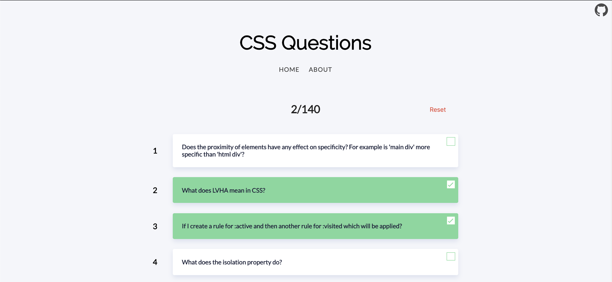

# [CSS Questions](http://cssquestions.io/)

A list of 140 CSS questions and answers. Written while reading the MDN CSS docs.

  

## Examples

Does the proximity elements have any effect on specificity? For example is 'main div' more specific than 'html div'?

What does LVHA mean in CSS?

What does :not(\*) select?

What are the three parameters the clamp() function takes?

## Why

I was frustrated that searching "CSS questions" returned a bunch of "Top 5-20 CSS questions" blog posts with questions that rarely asked actual CSS Questions. I thought a resource with more questions that focused soley on CSS might be useful.

## Development
Site was bootstrapped with [Create React App](https://github.com/facebook/create-react-app) 

1. `git clone git@github.com:codypearce/css-questions.git`
2. `npm i`
3. `npm start`

All questions are stored in `src/questions`

## Contributing

All contributions are welcome including new questions, fixing current questions or design. Many questions were written in a short time period and could use review.
